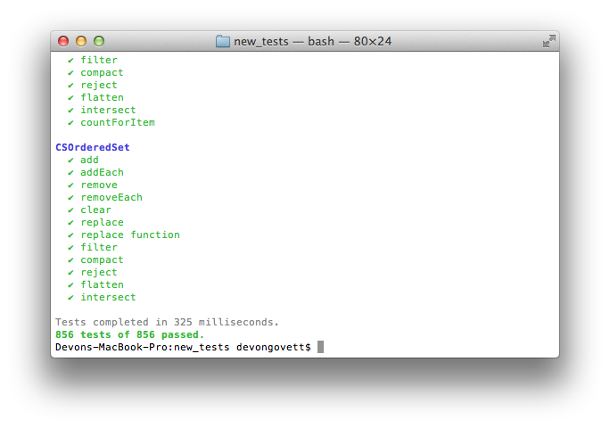

qunit-cli
=========

A Node module that adds colorful CLI support for the [QUnit](http://qunitjs.com)
testing framework.



## Usage

There are two ways to use qunit-cli:

1. Include it at the top of your test files. First, install the module using npm.

        npm install qunit-cli

    And now, require it in your test files:

        if (typeof QUnit == 'undefined') // if your tests also run in the browser...
            QUnit = require('qunit-cli');
        
        // use QUnit as you normally would.

    Note that this module does not introduce QUnit into the global scope like QUnit
    does in the browser, so you'll have to do that yourself if needed.

    To run, use the `node` program.

        node mytests.js

2. Use the command-line testrunner located at `bin/qunit-cli`, passing it the test files as arguments.
    If you install the module globally using npm, you can use the `qunit-cli` command which will be 
    installed into your PATH.

        npm install qunit-cli -g
        qunit-cli mytests.js

    This will introduce QUnit into the global scope like QUnit does in the browser,
    so you don't need to modify the tests themselves. You can use both methods in
    the same test files without problems.

## Command line options

There are several command line options available when running your tests using
qunit-cli that mimic some of the options in the standard browser-based QUnit
testing interface.  They are:

    --module, -m    Limits testing to an individual module
    --test,   -t    Limits testing to a single test (by number)
    --quiet,  -q    Flag to hide passed tests from the output

The command-line test runner has some additional options available:

    --code,   -c    Path to code loaded globally. You can prefix a namespace
                    using a colon (:)

Here are some examples:

```bash
# code exports are added to global namespace
qunit-cli -c /path/to/code test.js

# code exports are added to ns namespace
qunit-cli -c ns:/path/to/code test.js
```

## License

`qunit-cli` is released under the MIT license.
